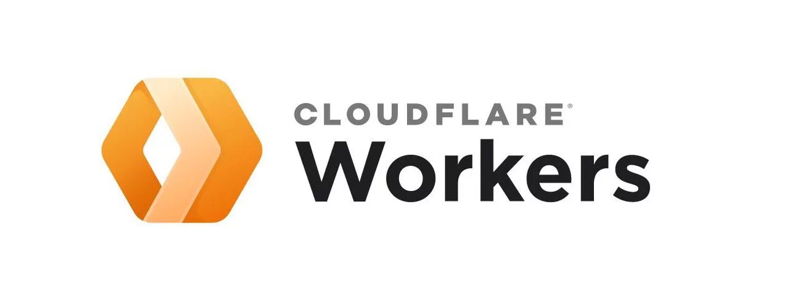

# db8bot-book-request-api



## The Service API for db8bot handling non-fiction & fiction book access requests.

## Build from Source
The project is built on Cloudflare Workers. There are no specific environment variables or configurations required. Simply deploy like any Cloudflare Workers project. For detailed deployment instructions see [here](https://developers.cloudflare.com/workers/get-started/guide/). 

## Prebuilt Versions
Since this is a service API for db8bot, there are no prebuilt versions available to the public. To get access to the functions provided by this API, please install db8bot on your Discord server. See [this](https://github.com/airfusion45/db8bot) repositiory for more.

## Basic Usage
* The `/paper` endpoint is deprecated as of March 8th 2023.
* For the `/book` endpoint:
    * POST request with x-www-form-urlencoded
    * Payload:
    ``` js 
    {
        query: <search text/ISBN>
        params: <fiction | nonfiction>
    }
    ```

## Features

Returns detailed information if the query is found.
``` js
[
    "IPFS link directly to the entry",
    "Direct link to the search page which shows other potential listings other than the first result.",
    {
        "libgenID": "ID in libgen's system",
        "author": "",
        "title": "Title of Book",
        "isbn": "All available ISBNs",
        "publisher": "",
        "year": "Year published"
    }
]
```

## Contributors

* *AirFusion45* - Original Author
* *BW* - Finding a bug where the API fails to return the book title and instead returns the book series name. This report also helped us to track down an issue where no ISBNs were returned despite ISBNs data present.

## License 
This Project is licensed under MIT License - see the LICENSE.md file for more details. The main points of the MIT License are:
  
  * This code can be used commercially
  * This code can be modified
  * This code can be distributed
  * This code can be used for private use
  * This code has no Liability
  * This code has no Warranty
  * When using this code, credit must be given to the author

## Privacy
Please see db8bot's privacy policy.

## Contact Me
Feel free to contact me if you find bugs, license issues, missing credits, etc.

  * Please contact me here:
    * Email: jim@airfusion.dev
    * Discord: AirFusion#1706
